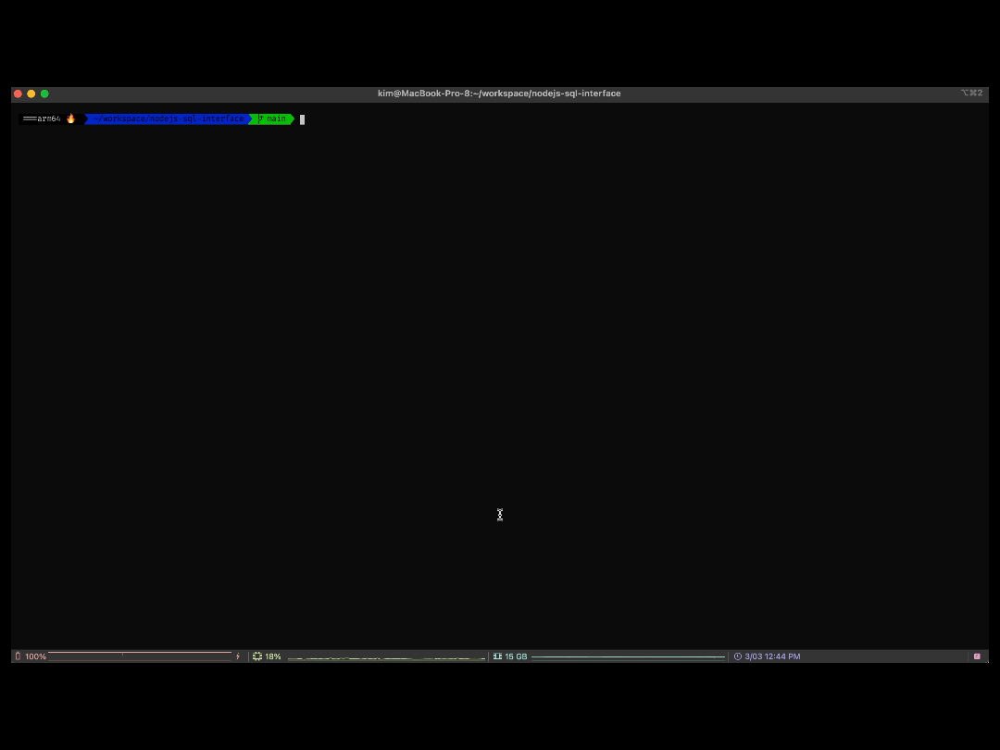

# nodejs-slq-interface
nodejs slq2/promise interface

install package

    npm i
    
init DB 

    npm run DB
    

insert user
  
    npm start <i || insert || INSERT> <ID> <PW> <email>
    
select user
 
    npm start <s || select || SELECT> <SELCT LIST Optional> <FROM Optional> <WHERE Optional>
    

